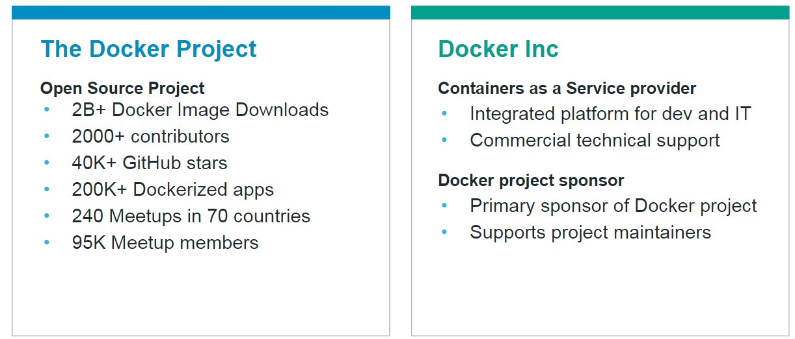
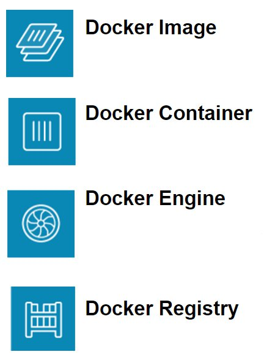
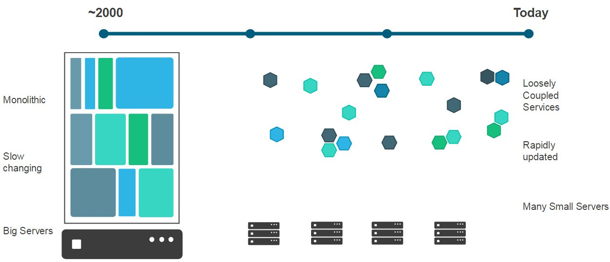
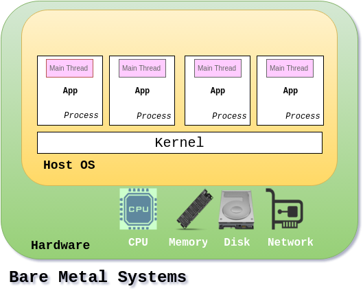
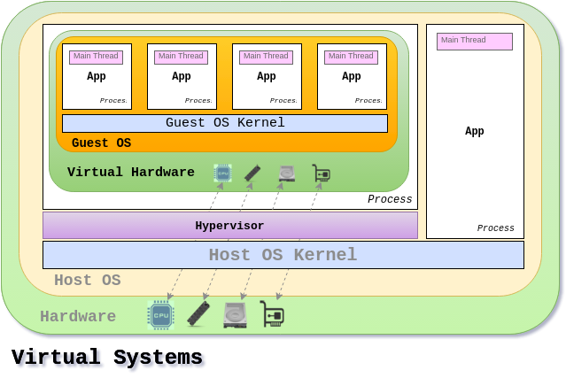
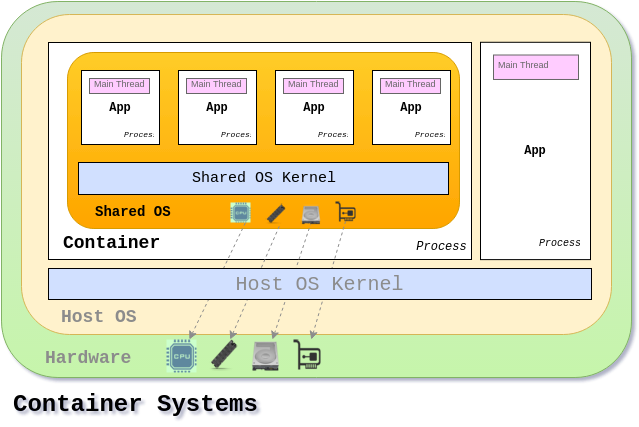

## Docker Introduction

- What is Docker?
- Why Docker?
- What is a container?

---

### What is docker?

---

--

### Why Docker?

---

### Containers as solution

- Packages up software binaries and dependencies
- Isolates software from each other 
- Container is a standard format
- Easily portable across environment
- Allows ecosystem to develop around its standard

---

### Why should develpors care?

- A clean, safe, hygienic and portable runtime environment for your app.
- No worries about missing dependencies, packages and other pain points during subsequent deployments.
- Run each app in its own isolated container, so you can run various versions of libraries and other dependencies for each app without worrying
- Automate testing, integration, packaging…anything you can script 
- Reduce/eliminate concerns about compatibility on different platforms, either your own or your customers. 
- Cheap, zero-penalty containers to deploy services?

---

### Why should Ops care?

- Make the entire lifecycle more efficient, consistent, and repeatable
- Increase the quality of code produced by developers. 
- Eliminate inconsistencies between development, test, production, and customer environments
- Support segregation of duties
- Significantly improves the speed and reliability of continuous deployment and continuous integration systems
- Because the containers are so lightweight, address significant performance, costs, deployment, and portability issues normally associated with VMs

---

### What is a container?

<small>Use of the following images by [Mani Sarkar](http://codurance.com/2016/03/16/Containers-all-the-way-through) personally granted.</small>

---

---

---

---

### Comparison

---

[__HOME__](..)
